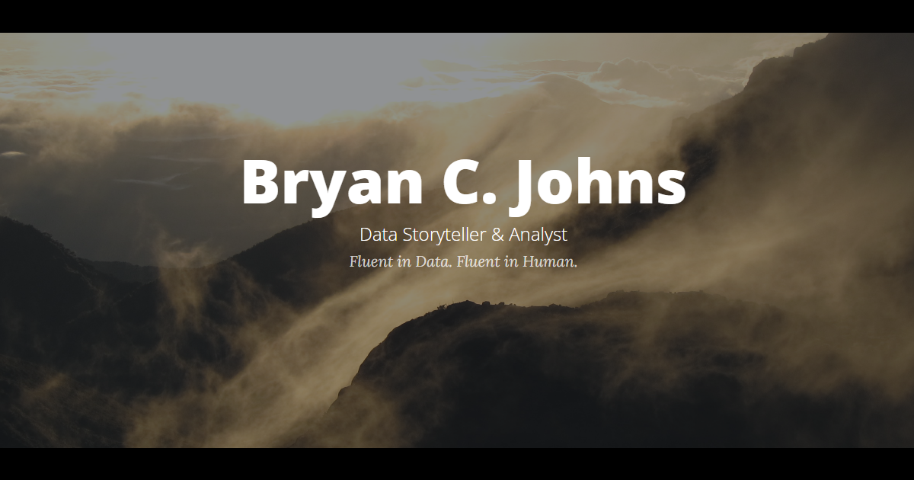

# Portfolio – Bryan C. Johns

🔗 [Portfolio Website](https://informedwanderer.com)

This repository contains the source for my personal data portfolio website. It brings together featured projects, exploratory analyses, and experiments across data science, visualization, and storytelling.

## Structure

- **Home** – Featured projects and highlights
- **Archive** – Additional and experimental projects
- **Project Pages** – Dedicated landing pages with summaries, visuals, and links
- **About** – Background, skills, CV, and credentials
- **Contact** – Email form for collaboration and inquiries

## Features

- **Project Gallery:** Browse a range of data science projects, from predictive modeling and dashboards to geospatial storytelling.
- **Dedicated Project Pages:** Each project includes a summary, visuals, and links to supporting resources (dashboards, maps, writing samples, GitHub repos, Tableau stories, and more).
- **Interactive Visualizations:** Explore dashboards, mapping tools, exploratory analyses, technical reports, and layperson-friendly overviews.
- **Responsive Design:** Built with the Clean Blog theme by Start Bootstrap for seamless use across devices.

## Featured Projects

- **[Classified: At-Risk](https://informedwanderer.com/workshop/salifort-employee-churn.html)** – AI-driven machine learning models for predicting employee turnover and supporting HR retention strategies
- **[Cyclistic Analytics](https://informedwanderer.com/workshop/cyclistic.html)** – Data analysis of Chicago’s bikeshare for customer conversion and marketing recommendations
- **[Capital Crashpad](https://informedwanderer.com/workshop/capital-crashpad.html)** – Dashboard of Airbnb statistics in Washington, DC

- **[Waypoints](https://informedwanderer.com/workshop/waypoints.html)** – A geospatial travel memoir combining mapping, routing, and narrative

Additional projects are available in the Living Archive, ranging from biodiversity dashboards to real-time earthquake maps.

## Usage

Explore the website [here](https://informedwanderer.com).

For updates:

- To add a new project, use the template at `./workshop/00_post_template_sample.html`.
- Update the meta data (description, title) for each new project page.
- The business card QR code is located in `./resources/images/`.

## Acknowledgements

Thanks to Start Bootstrap for the [Clean Blog](https://startbootstrap.com/theme/clean-blog) Theme.

## Author 

Copyright &copy; Bryan C. Johns, <!-- START_DATE -->2026<!-- END_DATE -->  
[bryan.johns@informedwanderer.com](mailto:bryan.johns@informedwanderer.com) | [LinkedIn](https://www.linkedin.com/in/b-johns/) | [GitHub](https://github.com/johbry17) | [Portfolio](https://informedwanderer.com)  
— Fluent in Data. Fluent in Human.
